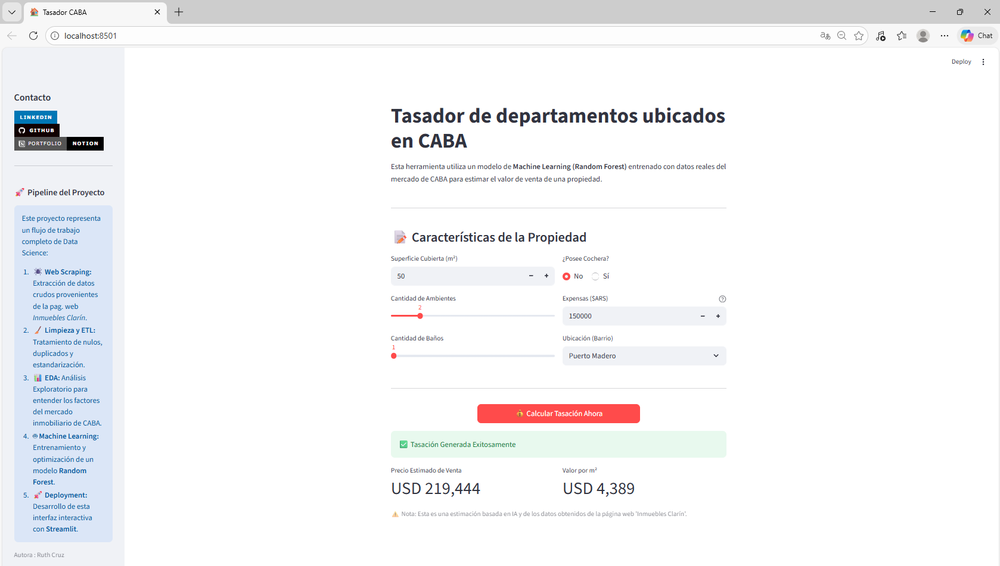

# 🏠 Predicción de Precios Inmobiliarios en  CABA ( Projecto de Machine Learning de comienzo a fin)


Este proyecto es una solución completa de **Data Science** diseñada para estimar el valor de mercado de departamentos en la Ciudad Autónoma de Buenos Aires (CABA). Utiliza técnicas avanzadas de Machine Learning para analizar patrones en el mercado inmobiliario y ofrecer tasaciones automáticas.

---

## 📸 Demo de la Aplicación


*(La interfaz permite al usuario ingresar características y obtener una tasación en tiempo real)*

---

## 🚀 Pipeline del Proyecto

El flujo de trabajo abarca el ciclo de vida completo del dato:

1.  🕷️ **Web Scraping:** Extracción automatizada de datos de la página web de *Inmuebles Clarín*. Puedes ver el código de extracción en este [repositorio](https://github.com/RuthCruz09/scraping-inmuebles).
2.  🧹 **Data Cleaning & ETL:**
    * Imputación de valores faltantes (MICE).
    * Detección y eliminación de outliers (Filtros de superficie y precio).
    * Ingeniería de variables (Feature Engineering).
3.  📊 **EDA (Análisis Exploratorio):** Estudio de correlaciones y distribución de precios por barrio.
4.  🤖 **Modelado (Machine Learning):**
    * Comparación de algoritmos: Regresión Lineal vs. Random Forest.
    * **Modelo Ganador:** Random Forest Regressor.
    * **Optimización (Tuning):** Ajuste de hiperparámetros para reducir la varianza y el overfitting.
5.  📦 **Deployment:** Serialización del modelo (`.pkl`) e implementación de una interfaz web con **Streamlit**.

---

## 📊 Resultados y Métricas

El modelo final fue evaluado utilizando un set de prueba (Hold-out Test Set) del 20%, logrando métricas competitivas para el mercado real:

| Métrica | Valor | Interpretación |
| :--- | :--- | :--- |
| **R² Score** | **~0.77** | El modelo explica el 77% de la variabilidad de los precios. |
| **MAE** | **~25k USD** | Error absoluto medio por propiedad. |
| **Estabilidad** | **Alta** | Validado mediante Cross-Validation (5 Folds). |

---

## 🧠 Insights de Negocio

Durante el análisis, descubrimos los principales  factores de Valor del mercado inmobiliario en Buenos Aires:
* 📍 **Ubicación:** El barrio es el factor más determinante. La brecha entre zonas exclusivas (Puerto Madero) y zonas sur supera el 300%.
* 🏢 **Expensas como Proxy:** Las expensas altas correlacionan positivamente con el precio de venta, actuando como indicador de categoría/amenities del edificio.
* 📉 **No-Linealidad:** El precio por $m^2$ no es constante; varía significativamente en propiedades muy pequeñas o muy grandes.

---

## ⚙️ Instalación y Uso Local

Sigue estos pasos para correr el proyecto en tu computadora:

1.  **Clonar el repositorio:**
    ```bash
    git clone [https://github.com/RuthCruz09/tu-repositorio.git](https://github.com/RuthCruz09/tu-repositorio.git)
    cd tu-repositorio
    ```

2.  **Crear un entorno virtual (Recomendado):**
    ```bash
    python -m venv venv
    source venv/bin/activate  # En Windows: venv\Scripts\activate
    ```

3.  **Instalar dependencias:**
    ```bash
    pip install -r requirements.txt
    ```

4.  **Ejecutar la App:**
    ```bash
    streamlit run app.py
    ```

---


## 📂 Estructura del Proyecto

```text
├── data/                  # Datasets (crudos y procesados)
├── models/                # Archivos binarios del modelo (.pkl)
├── notebooks/             # Jupyter Notebooks (EDA y Entrenamiento)
├── app.py                 # Código fuente de la aplicación Streamlit
├── requirements.txt       # Lista de librerías necesarias
└── README.md              # Documentación del proyecto
```

## 👩‍💻 Autora y Contacto

**Ruth Cruz** - *Analista de datos*

<a href="https://www.linkedin.com/in/ruthncruz/" target="_blank">
  
</a>
<a href="https://github.com/RuthCruz09" target="_blank">
  
</a>

---